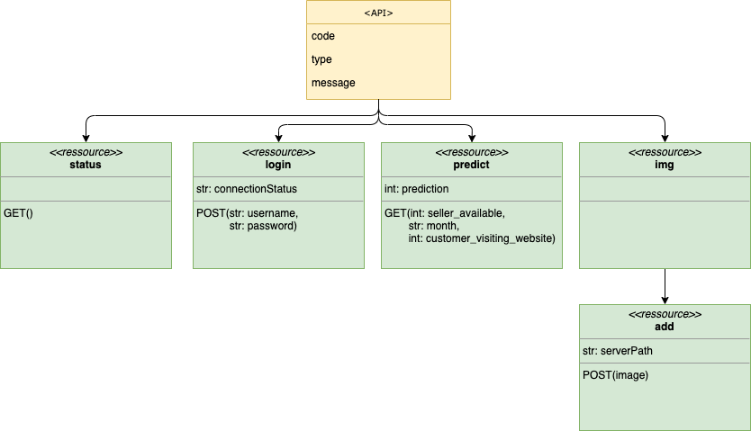

# Challenge flask API
Flask API Challenge @BeCode 

- Type of Challenge: `Learning`
- Duration: `3 days`
- Deployment strategy : `Heroku`
- Team challenge : `solo`

## Summary

Create a flask API which implement at least these requirements.

```
# Route to check if the server runs
GET /status -> "Alive!"

# Route to login
POST /login -> "Login success for user {USER_NAME_HERE} with password of length: {PASSWORD_LENGTH_HERE}!"
body: {
    username: <USER_NAME_HERE>
    password: <PASSWORD_HERE>
}

# Route that returns the prediction
GET /predict/<seller_avaible:int>/<month:str>/<customer_visiting_website:int> -> Prediction (int between 2000 and 5000)

```

### Must-have features

- [x] A GET route at /status that returns the string "alive"
- [x] A POST route at /login that returns a string containing "Login success for user  USER_NAME_HERE with password of length: PASSWORD_LENGTH_HERE!".
- [x] A GET route at /predict that takes 3 arguments (month, customer_visiting_website, seller_available) and returns an int between 2000 and 5000.

### Nice-to-have features

- [x] Follow pep8 rules.
- [x] Add a docstring for each route.
- [x] Use type hints in all your functions.
- [x] Use the Black formatter to format your code.
- [x] Add a route that takes an image and saves it on the server. Return the image's server path.
- [x] Add unit tests for at least one route.

## UML scheme



## Usage

Launch the API : `python main.py`
Access the API by using this url : `http://localhost:5000/`

## Installation
To install and run this project, you will be sure that your environnement must satisfy at least the following requirements :

- Docker : [see docker documentation](https://docs.docker.com/get-docker/)
- flask : 1.1.2

You will find all python modules in [`requirement.txt`](requirements.txt) 
or create you conda environnement by using [`conda_spec.txt`](conda_spec.txt)

## Live version
Do you want to test this API on heroku?
[Please follow this link](https://challenge-flask-jcoumont.herokuapp.com/status)